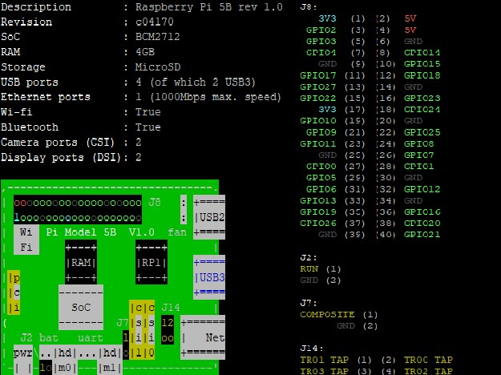
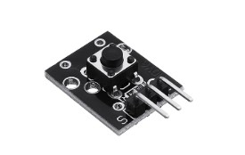
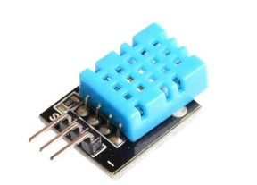
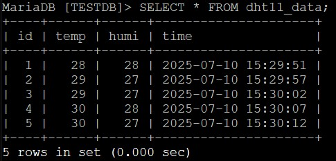
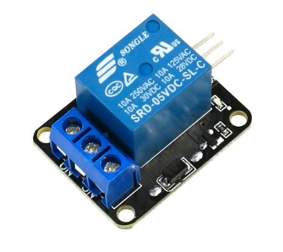

# iot-embedded-2025
IoT 임베디드 시스템 리포지토리

## 1일차
### 개발 환경
#### Raspberry Pi OS 다운로드
- https://www.raspberrypi.com/software/
- 디바이스 : RASPBERRY PI 5
- 운영체제 : RASPBERRY PI OS (64bit)
- 저장소 : SD카드
- OS 커스터마이징 : 일반 - 무선랜 설정, 서비스 - SSH 사용
- 설치 후 라즈베리파이에 장착

#### Raspberrypi SSH 활성화
- Putty Host Name : raspberrypi.local -> SSH -> Open
- sudo raspi-config
- Interface Options -> SSH -> Yes

#### VNC Viewer 다운로드
- https://www.realvnc.com/en/connect/download/vnc/?lai_vid=DBj1M9KX8Hxrx&lai_sr=5-9&lai_sl=l

#### SD카드 Formatter 다운로드
- https://www.sdcard.org/downloads/formatter/
 
#### Raspberry Pi 시작하기
- sudo apt update & sudo apt upgrade -y
- sudo reboot now
- sudo raspi-config
- Interface Options -> VNC -> Yes
- 한글 설정
  1. 나눔 폰트 설치 : sudo apt install fonts-nanum fonts-nanum-extra
  2. 폰트 등록 : sudo apt install fonts-unfonts-core
  3. 터미널 한글 설정 : Raspberry Pi Configuration - Local - ko, UTF-8 설정

  <!-- - 한글 입력, 추후 수정!!
    - sudo apt install ibus
    - sudo apt install ibus-hangul -->

#### nanorc 수정
  - sudo nano /etc/nanorc 주석 해제
    - set autoindent
    - set linenumbers
    - set tabsize 4

### 파일 관련 명령어
- ls -al : 숨김 포함 파일 목록
- ls -l : 상세 파일 목록
- ls *.txt : .txt 확장자 파일 목록
. / .. : 현재 / 상위 디렉토리
~ : 홈 디렉토리


## 2일차
### 파이썬 가상환경
- 프로젝트마다 파이썬 패키지 다르기 때문에 충돌 발생 가능성 있음
- 가상환경을 만들어 독립적으로 관리
- 생성 : python -m venv --system-site-package env
- 실행 : cd env/bin -> source activate

### 라즈베리파이 5 사양
- pinout

  

  - 3.3V / 5V : 전원 공급
  - GND(Ground) : 접지
  - GPIO : 제어 신호를 주고 받는 핀

### 브레드보드


- (+)전원 : 5V, 3.3V
- (-)접지 : GND
- 전원, 접지 가로 방향 연결
- 핀 세로 방향 5칸 연결

### 전류 흐름
- 전류가 흐르기 위해서는 반드시 전압차가 필요
- 이론적 흐름 : (+) -> (-)
- 실제 전자 흐름 : (-) -> (+)

#### 직렬연결과 병렬연결
- 직렬 : 전류가 동일, 전압은 분배
- 병렬 : 전압이 일정, 전류는 분배

#### 아날로그와 디지털
- 아날로그 : 연속적인 값을 가짐. 센서 값이나 온도처럼 변화하는 값
- 디지털 : 0 또는 1의 값만을 가짐. 이진수 기반. 스위치처럼 확실한 상태 구분

#### GPIO 제어 (RPi.GPIO 모듈)
- 핀 번호 체계 설정
  - GPIO.setmode(GPIO.BCM) : 논리 핀 번호 사용
  - GPIO.setmode(GPIO.BOARD) : 물리핀 번호 사용

- 핀 모드 설정
  - GPIO.setup(핀번호, GPIO.IN) : 입력 모드
  - GPIO.setup(핀번호, GPIO.OUT) : 출력 모드

- 입출력 제어
  - GPIO.input(핀번호) : 입력 값 읽기
  - GPIO.output(핀번호, HIGH) : 3V, 5.5V 출력
  - GPIO.output(핀번호, LOW) : 0V 출력

- 사용 후 초기화
  - GPIO.cleanup() : 사용한 핀 초기화

### 센서
#### LED
- LED RGB 모듈 140C05 사용

  

  - (V) : Vcc (+)
  - (R) : Red 
  - (B) : Blue
  - (G) : Green

- LED의 (V)가 Vcc에 연결되어 있고 GPIO를 통해 GND처럼 동작하기 때문에 LOW할 때 LED 켜짐

- [코드 실습 영상](./Chapter01/led.py)

  https://github.com/user-attachments/assets/609d2532-0b06-44c2-a1b4-ace349429a01
  
#### 스위치
- 버튼 스위치 모듈 KY-004 사용

  

  - (-) : GND
  - ( ) : Vcc
  - (S) : Signal

- [코드 실습 영상](./Chapter01/button.py)

  https://github.com/user-attachments/assets/fb5ac6c6-d7db-4689-a701-fcadba99ae39

- 풀 업 / 풀 다운 저항
  - 스위치를 누르면 GND에 닿아 입력핀이 기본값을 읽어옴
  - 풀 업 : 기본 값 1(HIGH), 스위치를 누르면 0(LOW)
  - 풀 다운 : 기본 값 0(LOW), 스위치를 누르면 1(HIGH)


 ## 3일차
 ### 센서
 #### 온습도
- 온습도 센서 모듈 DHT11 사용

  

- pip install adafruit-circuitpython-dht
- sudo apt install libgpiod2

- (-) : GND
- ( ) : Vcc - 3.3V
- (S) : Signal

#### DB에 온습도 데이터 넣기
- DB 설치
  - sudo apt install mariadb-server

- DB 접속
  - sudo mysql
  - show databases;

- root 사용자 비밀번호 설정
  - ALTER USER 'root'@'localhost' IDENTIFIED BY '비밀번호';

- DB / TABLE 생성
  - CREATE DATABASE 데이터베이스이름;
  - CREATE TABLE 테이블이름 (데이터 설명);

- 데이터 삽입
  - pip install mysql-connector-python
  ```python
  import mysql.connector

  
  db = mysql.connector.connect(
       host = "localhost",
       user = "root",
       password = "",           # 보안상 생략
       database = "TESTDB"
  )

  cursor = db.cursor()

  ...

  while True:
      try:
          cursor.execute("INSERT INTO dht11_data (temp, humi) VALUES (%s, %s)", (temp, humi))
          
          db.commit()

  ...

  ```

  - TESTDB.dht11_data

    


## 4일차
### PyQt
#### PyQt 설치
  - sudo apt install python3-pyqt5
  - sudo apt install qttools5-dev-tools

#### PyQt 기본 구조
```python
import sys
from PyQt5.QtWidgets import QApplication, QWidget

app = QApplivation(sys.argv)      # 객체 생성
window = Qwidget()                # 기본 윈도우 생성
window.show()                     # 윈도우 보이기
app.exec_()                       # 이벤트 루프 실행
```

#### PyQt UI 파일 로드
```python
uic.loadUi("hello.ui", self)
uic.loadUiType("hello.ui")[0]
```

#### PyQt 실행 환경
- putty에서는 실행 불가. 텍스트 기반 터미널이라 GUI가 나타나지 않음
- VNC Viewer에서 실행해야 GUI 확인 가능


## 5일차
### 주파수 (Frequency)
- 단위 : Hz
- 1초 동안 반복되는 연산횟수.
- 주파수가 높을수록 단위 시간당 더 많은 연산을 수행함.

### PWM 제어
- 디지털 신호의 ON/OFF 시간을 조절해 평균 전압을 제어하는 방식
  - 디지털 신호지만 아날로그처럼 동작
- Duty Cycle : 전체 주기 중 ON 상태의 비율
  - 0% : 항상 OFF (LOW)
  - 50% : ON 50%, OFF 50%
  - 100% : 항상 ON (HIGH)

### 센서
#### 부저
- 수동 부저모듈 KY-006

  

- 수동 부저 (Passive Buzzer)
  - PWM을 이용해 주파수를 넣어줘야 소리가 남
  - 원하는 음 높이 조절 가능

- 능동 부저 (Active Buzzer)
  - 전원 공급 시 자동으로 정해진 소리를 냄
  - ON/OFF 제어만 하면 됨. (GPIO.HIGH / GPIO.LOW)

- (-) : GND
- ( ) : Vcc
- (S) : Signal

- [코드 실습 영상](./Chapter04/buzzer3.py) : 경찰차 사이렌 구현
  
  https://github.com/user-attachments/assets/8524b065-10fc-4fd4-92b2-83a60875a34e
 
- [코드 실습 영상](./Chapter04/buzzer4.py) : 키보드 피아노 구현
  
  https://github.com/user-attachments/assets/f7673596-133f-48f6-96de-4cf3c3c1310e


## 6일차
### 센서
#### 릴레이 모듈
- 1채널 5V 릴레이 모듈 사용

  

- 릴레이 : 전자 스위치. 전기 신호로 전류 흐름 제어
- 릴레이 출력 부
  - NO (Normally Open) : 평소에 열려있음. 신호를 주면 닫히면서 전류가 흐름
  - NC (Normally Closed) : 평소에 닫혀 있음. 신호를 주면 열리면서 전류 차단
  - 공통 단자 : 제어하고 싶은 외부 회로 전원 연결

- (S) : Signal
- (+) : Vcc
- (-) : GND

- 인터럽트 : 갑작스러운 이벤트에 자동 반응하는 처리 방식
  - 상태변화가 생기면 메인 루프가 무슨 작동을 하고 있든 등록한 함수 즉시 실행
  ```python
  GPIO.add_event_detect(btnpin, GPIO.BOTH, callback=func)
  ```
  : 버튼이 눌리는 순간 func 함수 자동 호출

- [코드 실습 영상](./Chapter05/interrupt_led.py)

  https://github.com/user-attachments/assets/5c0c5208-333f-4362-9822-04748d1f86b6


## 7일차
### Flask
: 간단하고 빠르게 웹서버 구축
- 작동 흐름
  1. 사용자 : 브라우저에서 주소 접속
  2. Flask 서버 : 해당 URL에 맞는 함수 실행 
  3. 결과 반환 : 웹 페이지에 출력

- 필요 라이브러리 : from flask import Flask
- 기본구조
  ```python
  from flask import Flask
  app = Flask(__name__)

  @app.route('/')
  def home():
      return "LED Control Web"

  if __name__ == '__main__':
      app.run(host="0.0.0.0")
  ```
- host="0.0.0.0" : 모든 외부 IP Flask 서버 접근 가능